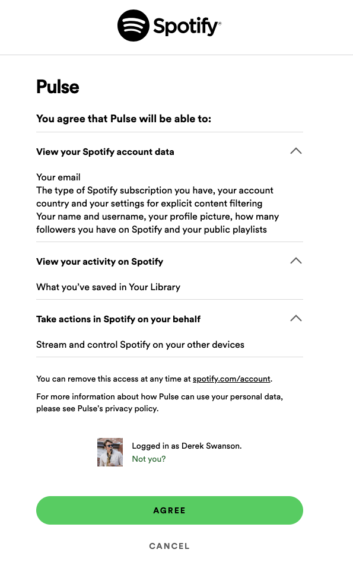
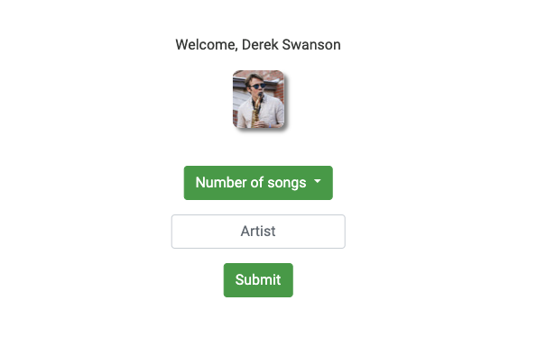
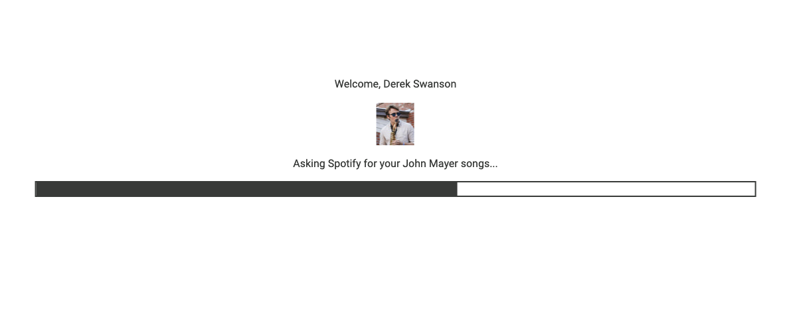
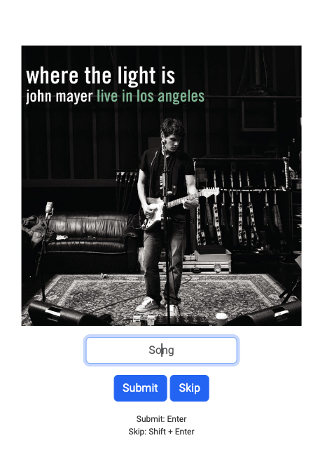
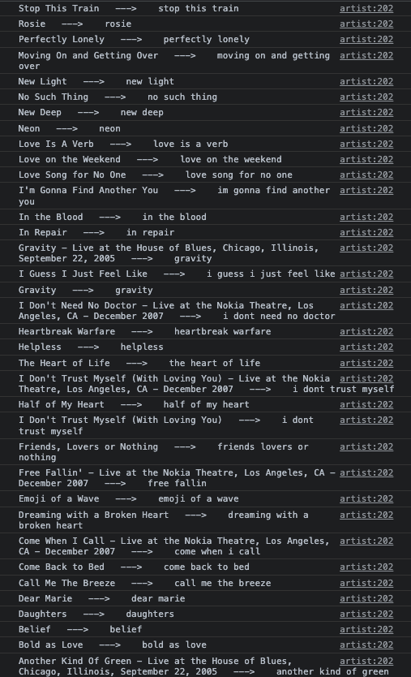
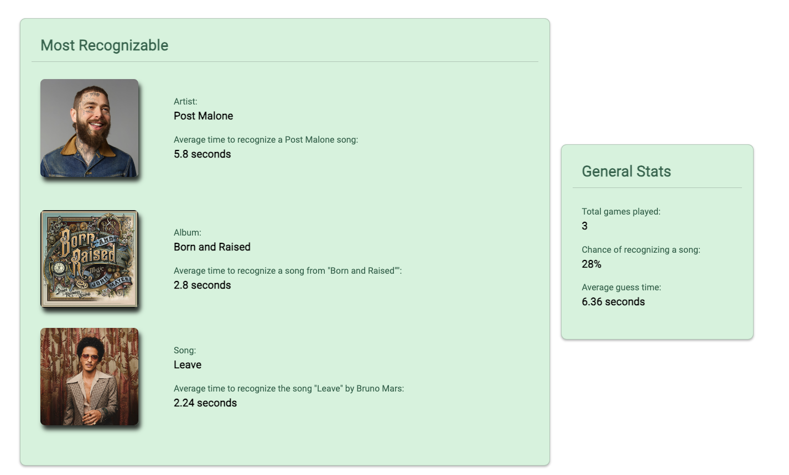
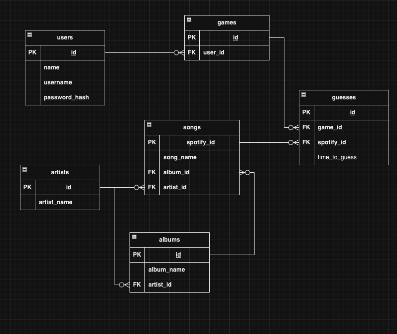

# Pulse
Pulse is a music trivia game that tests a user's knowledge of the music they listen to. 
First, Pulse will access the user's Spotify account. They will then be presented with multiple songs from their Spotify library and will be asked to guess the name of the song as fast as possible by ear.
The user can then view interesting statistics regarding their performance on the 'Game Data' page.
This README provides a showcase of the website's major functions, along with a brief discussion of lessons learned at the end.

Below is a brief demo with audio:

https://github.com/drs0057/Pulse/assets/118777627/ab495f5d-bd15-4701-bcef-ecd0bb31bee7

# Spotify Authentification
Pulse operates by accessing a user's Spotify account and requesting the appropriate songs. Once a user creates an account with Pulse and navigates to the play tab, they will be redirected to Spotify to give Pulse consent to access their library and play music on their account's behalf:

  

# Starting the game
The user begins the game by selecting a game mode (only one type is currently supported). Next, the user will select the number of songs they wish to guess and the name of an artist. 
Spotify only allows so many songs to be requested from a user's library at a time. This creates a 10+ second waiting time once an artist's name is submitted. A progress bar serves to show the user the time remaining for the backend to access the entirety of their library from the Spotify servers. Once this is complete, they will be redirected to the game and may begin.

  

 

  

# The Game
Below is a picture of the game in action. The user is currently being asked to guess the name of the song as it plays through their speakers. The album cover associated with the song is displayed to aid the user. If the user knows the name of the song, they can input it in the text field and hit 'Submit'. They may optionally hit the 'Skip' button if they cannot remember the song. If the user does not guess the song within 20 seconds, the song is automatically skipped. Keyboard shortcuts are provided on the screen to aid the user in submitting their guesses as fast as possible.

  

 

# Song name normalization
Song titles can be complicated. Titles may contain symbols in place of words ($ for S, & for and), names of featured artists, or performance venues/dates in the case of live recordings.
This makes accurately guessing the exact song title very difficult.
Pulse removes this concern to create a more enjoyable playing experience.
Song names are normalized and stripped to only contain the title of the song in its most simple form. These simple song names allow the user to focus more on guessing the actual name of the song, as opposed to worrying about the exact nature of their text input. Below are some examples of song guesses that Pulse will look for. Note how long, complicated titles are greatly simplified:

  

# Game Data
Once a user has played at least one game, they may access the game data page. This page gives a user some insight into all the games they have played. Pulse will show the user their most recognized artist, album and song. General data about their global play statistics is also available. If a user has played several games, they can use this page to gauge what aspects of their song library that they are most familiar with. This is the power of Pulse.

  

 

# Database
Pulse stores the data for these games in a MySQL database. The design for this database is shown below:

  

 
 
 

# Lessons Learned
Below I will discuss several of the lessons learned throughout this project, which will also serve to highlight some of the flaws of the project. These are issues that needed to be addressed in the middle of the project, or issues that still plague the project and will need to be handled early on in future projects.

### Design database and backend around third-party web API
When a third-party web API is a major part of the project's infrastructure, the project will have to be built around this API. The project is always subject to change, but the web API it uses is not. This fact must be kept in mind while designing any part of the project that will query, store, or utilize the data provided by the API.

Pulse's load times are occasionally long due to unnecessary querying of Spotify's web API. For example, song data for the "Game Data" page is queried from Spotify each time this page is loaded due to insufficient data being stored in the local MySQL database. In fact, artist/album/song data for that page relies on Spotify's "search" API, meaning results loaded into the game data page are not always accurate, and may, for example, display the wrong song. The issue could have been avoided by designing the database around Spotify's available endpoints from the very start and storing necessary data the first time it is encountered in the game.

### Cohesive HTML and CSS
Multiple different class schemes, whether it was for a page's layout or for styling a page using CSS, were used all over the website. This was the result of working on HTML and CSS on a whim over a long period of time. This lack of cohesion between all the stylistic layouts caused lots of headaches. Making global changes to the website's style were almost impossible without completely reworking every HTML template and every CSS class. Even adding new elements in alignment with the current style was difficult, as it was not clear which CSS classes to use. This duct-tape approach to styling must be avoided early on in future projects. Basic HTML structure along with CSS classes, color palettes, etc. must be decided on before any front-end work is started.

### Lack of OOP
This project utilizes OOP in very few places. Virtually the only place (besides imported libraries) that I used OOP was for the database. SQL Alchemy allowed me to query the database and instantiate objects based on the results of that query that I could then work with to gain insight into a user's game data. The lack of OOP for the rest of the project caused some issues early on. Each new task required of the backend meant a new, unique function had to be created and maintained. This sloppy "functional" approach led to more duct-tape-like code that required constant iteration and attention. The statelessness of the backend code made tracking user activities cumbersome. It would have been better, before any backend code was written, to conceptualize some basic classes and methods that could handle frequent operations like user authentification, routing, working with Spotify's API, etc.
