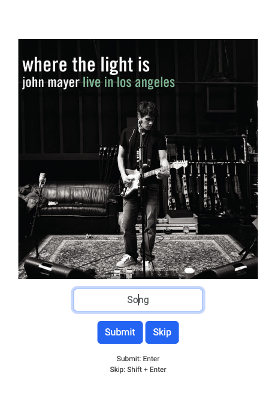

# Pulse
Pulse is a music trivia game that tests a user's knowledge of the music they listen to. 
First, Pulse will access the user's Spotify account. They will then be presented with multiple songs from their Spotify library and will be asked to guess the name of the song as fast as possible by ear.
The user can view interesting statistics regarding their performance on the 'Game Data' page.

TODO: show creating an account and authenticating with spotify

# Song name normalization
Song titles can be complicated. Titles may contain symbols in place of words ($ for S, & for and), names of featured artists, or performance venues/dates in the case of live recordings.
This makes accurately guessing the exact song title very difficult.
Pulse removes this concern to create a more enjoyable playing experience.
Song names are normalized and stripped to only contain the title of the song in its most simple form. Below are some examples of song guesses that Pulse will look for:

These simple song names allow the user to focus more on guessing the actual name of the song, as opposed to worrying about the exact nature of their text input.

# The Game
Below is a picture of the game in action:

The user is currently being asked to guess the name of the song as it plays through their speakers. The album cover that contains the song is displayed to aid the user. If the user knows the name of the song, they can input it in the text field and hit 'Submit'. They may optionally hit the 'Skip' button if they cannot remember the song. Keyboard shortcuts are provided on screen to aid the user in submitting their guesses as fast as possible.
