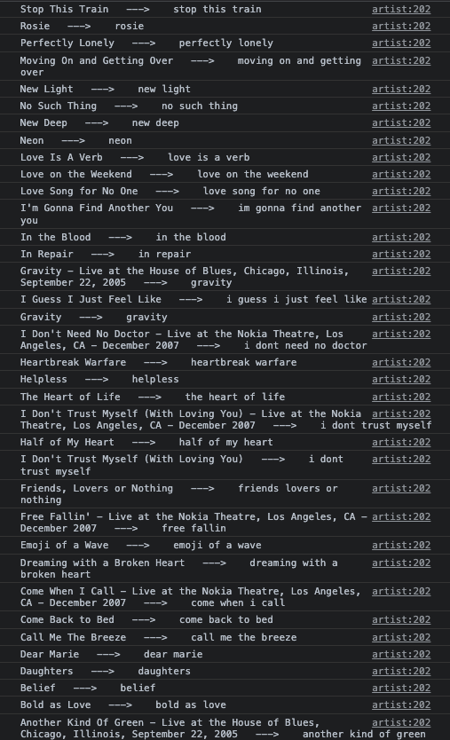

# Pulse
Pulse is a music trivia game that tests your knowledge of the music you listen to. 
First, Pulse will access your Spotify account. You will then be presented with multiple songs from your Spotify library and will be asked to guess the name of the song as fast as possible by ear.
A user can view interesting statistics regarding their performance on the 'Game Data' page.

TODO: show creating an account and authenticating with spotify

### Song name normalization
Song titles can be complicated. Titles may contain symbols in place of words ($ for S, & for and), names of featured artists, or performance venues/dates in the case of live recordings.
This makes accurately guessing the exact song title very difficult.
Pulse removes this concern to create a more enjoyable playing experience.
Song names are normalized and stripped to only contain the title of the song in its most simple form. Below are some examples of song guesses that Pulse will look for:

These simple song names allow the user to focus more on guessing the actual name of the song, as opposed to worrying about the exact nature of their text input.
